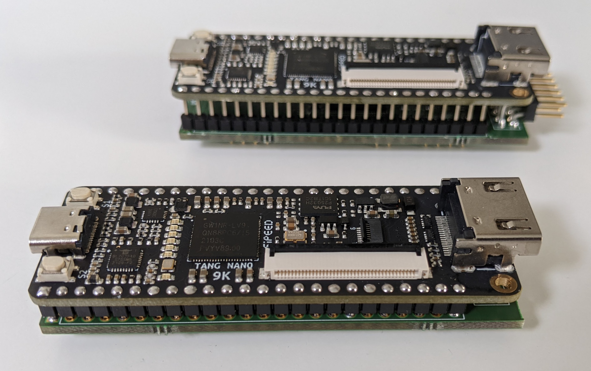

# TMS9918A compatible VDP based on Tang Nano 9k - Compact (SMD) version

This version is a compact variant of the tn_vdp_v1 board that directly
fits into the VDP socket of the TI-99/4A.  It uses SMD components and
has the same size as the Tang Nano 9k board.  It comes with a VGA
breakout connector that can be directly used if the space in the host
machine allows it, or be snapped off, mounted on a breakout panel on
the back of the host machine and be connected with a ribbon cable.

## BOM

|Item|Qty|Reference(s)|Value       |Description                              |Part Number            |Footprint|URL                                                               |
|----|---|------------|------------|-----------------------------------------|-----------------------|---------|------------------------------------------------------------------|
|1   |1  |            |Tang Nano 9k|FPGA development board                   |                       |         |https://wiki.sipeed.com/hardware/en/tang/Tang-Nano-9K/Nano-9K.html|
|2   |1  |U1          |1G08        |Single AND gate                          |SN74LVC1G08            |SOT-23-5 |http://www.ti.com/lit/sg/scyt129e/scyt129e.pdf                    |
|3   |1  |U4          |74LCX16245  |16 bit buffer                            |74LCX16245MTD          |TSSOP-48 |https://www.onsemi.com/pdf/datasheet/mc74lcx16245-d.pdf           |
|4   |1  |D1          |D_Schottky  |Schottky diode                           |MBR0530                |SOD-123  |                                                                  |
|5   |3  |R1, R5, R9  |4.7K        |Resistor SMD 0603                        |                       |0603     |                                                                  |
|6   |3  |R2, R6, R10 |2.2K        |Resistor SMD 0603                        |                       |0603     |                                                                  |
|7   |3  |R3, R7, R11 |1K          |Resistor SMD 0603                        |                       |0603     |                                                                  |
|8   |3  |R4, R8, R12 |470         |Resistor SMD 0603                        |                       |0603     |                                                                  |
|9   |2  |R13, R14    |47          |Resistor SMD 0603                        |                       |0603     |                                                                  |
|10  |1  |C1          |100nF       |Capacitor SMD 0603                       |                       |0603     |                                                                  |
|11  |21 |J1          |            |PCB pin Mill-Max                         |3157-0-00-15-00-00-03-0|         |                                                                  |
|12  |1  |J6          |VGA         |Pin Header 2.54mm Horizontal 16pos       |68021-116HLF           |         |                                                                  |
|13  |1  |J2          |VGA         |Ribbon cable 16 pin 2x8 solder to 2x8 IDC|                       |         |https://de.aliexpress.com/item/1005004165880347.html              |
|14  |1  |J5          |VGA         |DB15HD connector, female                 |                       |         |                                                                  |
