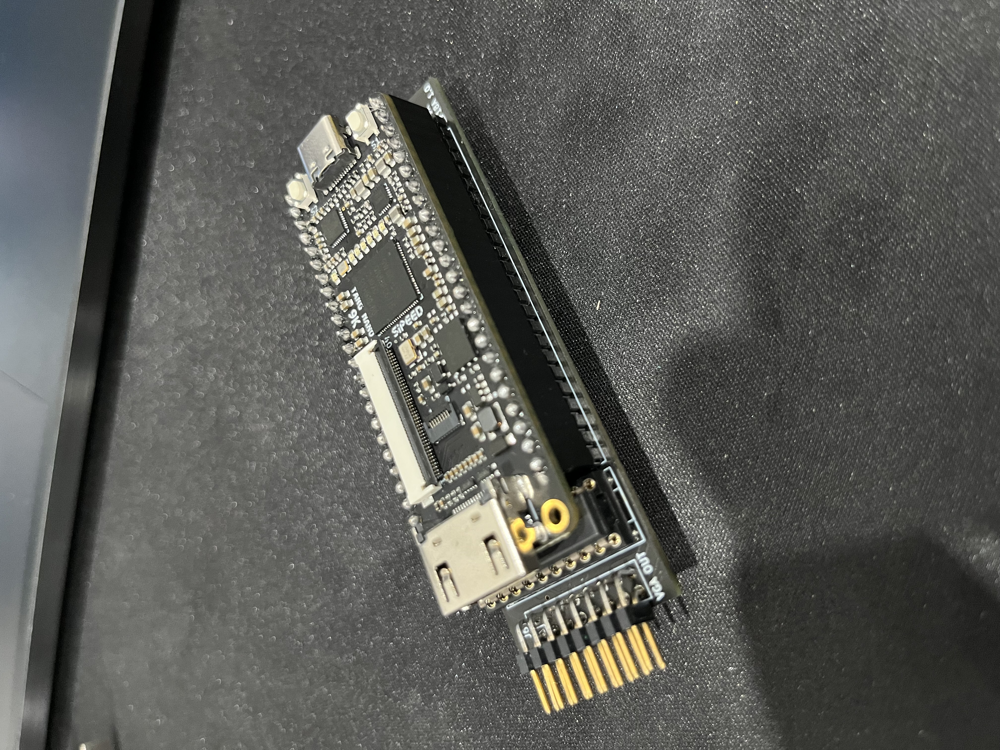

# tn9k_f18a
 
## Tang Nano 9K F18a Clone

This project recreates the F18a FPGA Board using the over the counter Sipeed's Tang Nano 9K board plus a designed set of boards to be stacked on top where the TMS9118 was located.

The bitstream file is fpga/tn9k_f18a/impl/pnr/tn9k_f19A.fs

## Floppy images

Bootable 80 colums for NABU PC CP/M 3 images can be downloaded here (flux and HxC2001): 

[NABU PC images](https://drive.google.com/file/d/1nU48-01ozhA_n-ZHN1SCNINqFqhcBxUN/view?usp=sharing)

## Gerber files

The gerber files can be located inside each KiCad project:

[MainBoard](KiCad/tn9k_f18a/gerber)

[VGA breakout](KiCad/tn9k_vga/gerber)

The VGA module is optional, only if you want VGA output.

## Gowin IDE
Follow this link to install the Gowin's IDE:

[IDE Installation](https://wiki.sipeed.com/hardware/en/tang/Tang-Nano-Doc/install-the-ide.html)

The FPGA series is GW1NR and the Device is GW1NR-9C. Use Embedded Flash Mode for permanent programming. Make sure the bitstream is set to Load Rate of 12.5Mhz (or higher) in the Project -> Configuration -> BitStream: Loading Rate (MHZ). The maximum for this device is 25 Mhz.

## Building:

The Tang Nano 9K board can be purchased on AliExpress or ebay.

The 2 boards gerber files are inside each kicad project gerber folders.

The BOM can be found here [DigiKey BOM](https://www.digikey.ca/short/2t98zrjw)

Or transcribed here
```
Qty | Part Number                | Description
----+----------------------------+----------------------------------
1x  | 123-A-HDF15A-KG-TAXB-ND    | CONN D-SUB HD RCPT 15P R/A SLDR
3x  | 123-AR20-HZL-TT-ND         | CONN IC DIP SOCKET 20POS TIN
2x  | S7022-ND                   | CONN HDR 24POS 0.1 TIN PCB
1x  | 449-KT04RTH-ND             | SWITCH SLIDE DIP 4POS 25MA 24V
3x  | 296-8503-5-ND              | IC TXRX NON-INVERT 3.6V 20DIP
3x  | 1109PHCT-ND CAP            | CER 0.1UF 50V X7R AXIAL
2x  | 2057-PH2RA-16-UA-ND        | CONN HEADER R/A 16POS 2.54MM
2x  | A835AR-ND                  | CONN HDR DIP POST 20POS GOLD
1x  | ED3048-5-ND                | CONN IC DIP SOCKET 40POS TIN
1x  | 2057-ICM-640-1-GT-HT-ND    | MACHINE PIN SOCKET, IC, DIP, 40P
1x  | 1528-5294-ND               | GPIO RIBBON CABLE 2X10 IDC CABLE
3x  | CF14JT2K20CT-ND            | RES 2.2K OHM 5% 1/4W AXIAL
2x  | CF14JT47R0CT-ND            | RES 47 OHM 5% 1/4W AXIAL
3x  | CF14JT4K70CT-ND            | RES 4.7K OHM 5% 1/4W AXIAL
3x  | CF14JT1K00CT-ND            | RES 1K OHM 5% 1/4W AXIAL
3x  | F14JT470RCT-ND             | RES 470 OHM 5% 1/4W AXIAL
```
**Notes:**

1) CONN HDR DIP POST 20POS GOLD: It is expensive on DigiKey but it can be sourced elsewhere cheaper, even Amazon.
2) GPIO RIBBON CABLE 2X10 IDC CABLE : It was supposed to be 2x8 but is out of stock. The 2x10 just works. Or build your own.
3) The capacitors need to be soldered manually on the bottom of each IC's. There are no pads for them to reduce the size of the board. See back.jpg photo for reference under images folder.
4) There are 2 DIP 40 sockets in this list: one machined other normal. The machined socket you will use to connect the board on top, thus protecting the pins. The machined pins for the board will connect easily to a machined socket. Then you stack this machined socked over the normal one (notice little force is necessary), and then finally you stack them at the NABU PC's TMS9118 socket. This will protect both the NABU and the TN9K_F18A pins.

## Jumper Settings

I took the liberty to change the way the jumper works because I found them a bit confusing. Since the F18a uses Pull Ups an On jumper means the jumper is removed. I changed that, to turn a jumper on you just close it instead:
```
USR1 : SPR MAX - Turn it on for 32 sprites per line
USR2 : SCANLIN - Turn it on for scanlines
USR3 : GROMCLK - Turn it on to have GROM CLOCK enabled, Disabling it puts CPUCLK on pin 37 (9128/29)
USR4 : CPUCLK  - Turn if on to have CPU CLOCK on pin 38 (9929/29 and 9128/29)
```

## Assembling Instructions

You shoulnd't have problem assembling it as all components are labeled. Just remember the 2 pin strips for the TMS9118 slot goes under the board as well the 3 caps. Everything else it on the top side. I personally prefer soldering the female header on the FPGA board. Mind the prientation of the **DIP switch** as the image below.


You need to solder the capacitors under each IC's. I made this way to reduce the size of the board.


And the final board stacked up. To avoid plugging the board inverted there are two labels on it: **USB-C SIDE** and **HDMI SIDE**. The orientation of the board towards the TMS9118 slot is the USB-C up (pin 1 of TMS9118). The TMS9118 pin number 1 and 40 are printed under it.


